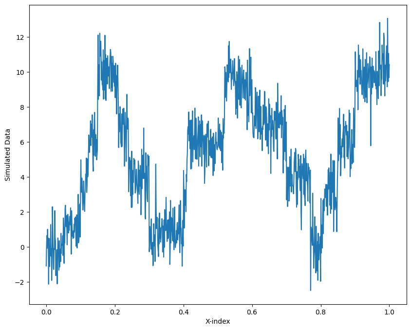
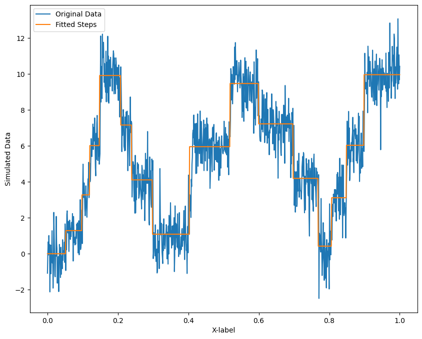
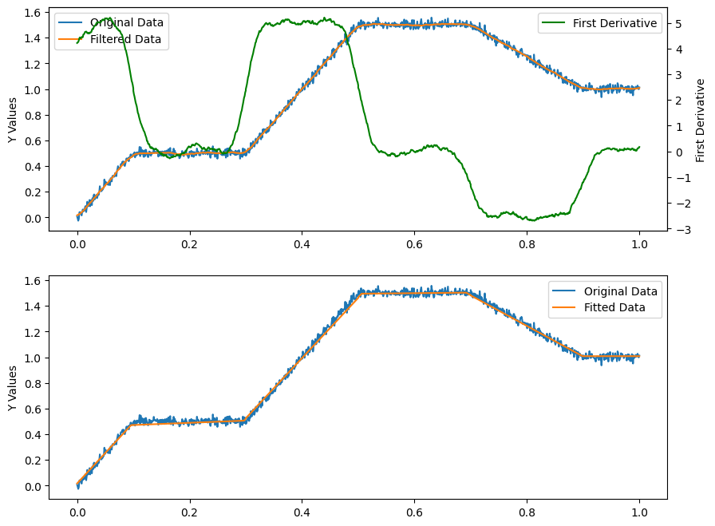
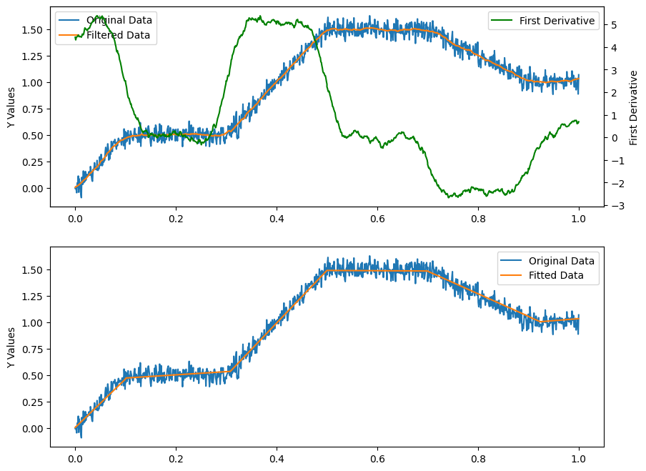
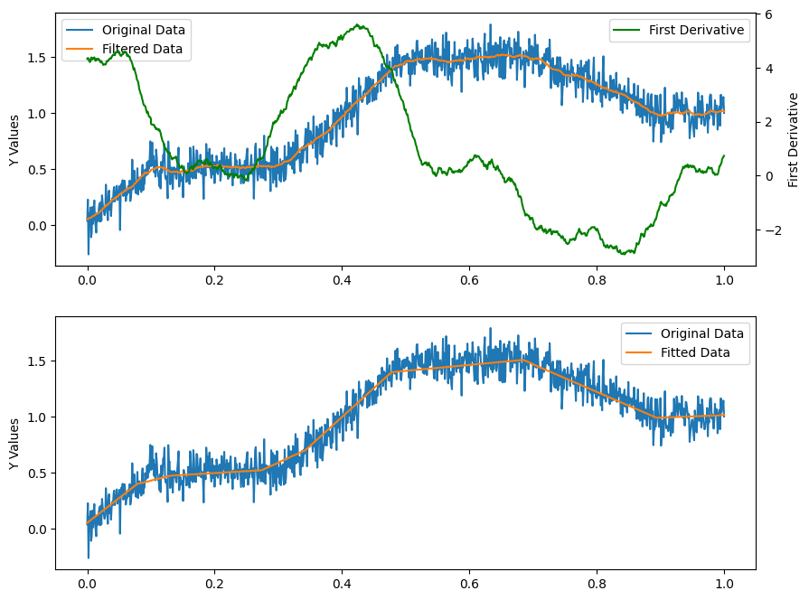

Bayesian Changepoint Detection For Single-molecule Studies
==============================

Methods to get the probability of a changepoint in a time series. 
    
To see it in action have a look at the [example notebook](Examples).


# To install:

### Enter a directory of your choice, activate your python virtual environment.

```bash
git clone https://github.com/longfuxu/bayesian_changepoint_detection_single_molecule.git
cd bayesian_changepoint_detection_single_molecule
pip install .
```
#### Now can use bayesian_changepoint_detection in python.

# Application on Step-wise Datasets
## please follow this step-by-step [notebook](Examples/example_stepwise_CPdetection.ipynb)



# Application on Piece-wise Datasets
## please follow this step-by-step [notebook](Examples/example_piecewise_CPdetection.ipynb)





# Todo
1. Develop a UI for non-coder use
2. Improve the code logic for speedy analysis (currently, it takes up to half a minite for 1000 data points, but bigger data sets, it might takes several minites for analysis.)
3. Write scripts for batch analysis

# Acknowledgement
Original Work from:  https://github.com/hildensia/bayesian_changepoint_detection

[1] Paul Fearnhead, Exact and Efficient Bayesian Inference for Multiple                                    
    Changepoint problems, Statistics and computing 16.2 (2006), pp. 203--213                               
                                   
[2] Ryan P. Adams, David J.C. MacKay, Bayesian Online Changepoint Detection,                            arXiv 0710.3742 (2007)                                                                              

[3] Xuan Xiang, Kevin Murphy, Modeling Changing Dependency Structure in                                    
    Multivariate Time Series, ICML (2007), pp. 1055--1062

