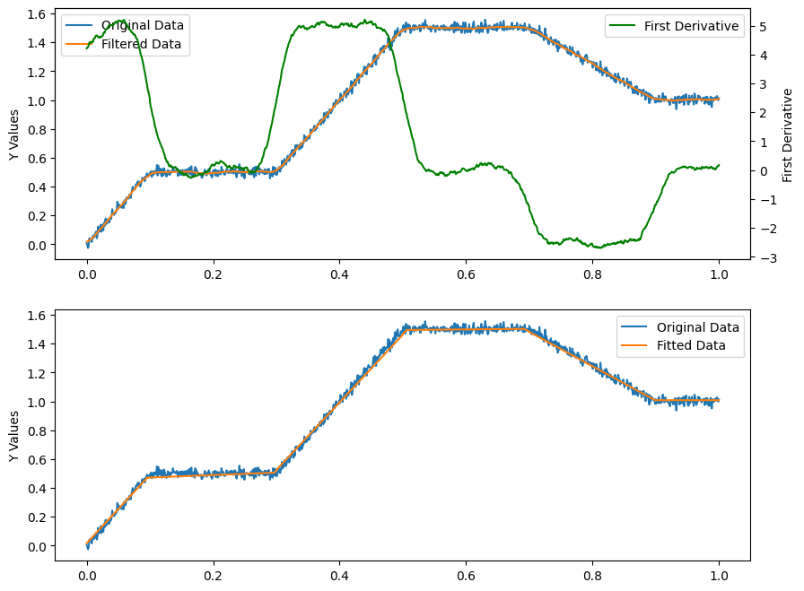
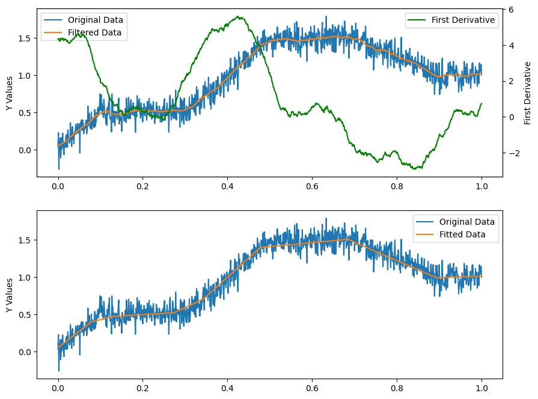

# Bayesian Changepoint Detection for Single Molecule Analysis

## Introduction
This repository contains Python code for detecting changepoints in single molecule datasets using Bayesian methods. The code allows for both piecewise and stepwise changepoint detection, which can be useful in various scientific analyses where abrupt changes in data need to be identified.

## Repository Structure
```
- main_piecewise_CPdetection.py: Main script for piecewise changepoint detection.
- main_stepwise_CPdetection.py: Main script for stepwise changepoint detection.
- Test_Data/: Directory containing test datasets.
- bayesian_changepoint_detection/: Package with modules for changepoint detection.
- Examples/: Directory with example output data and notebooks.
- Docs/: Documentation related images.
- setup.py: Setup script for installing the package.

```
## Installation and Requirements
To use this code, you will need Python 3.x and the following packages:
- numpy
- matplotlib
- scipy

You can install the required packages using `pip`:
```
pip install numpy matplotlib scipy
```

To install the Bayesian Changepoint Detection package, follow these steps:

```bash
git clone https://github.com/longfuxu/bayesian_changepoint_detection_single_molecule.git
cd bayesian_changepoint_detection_single_molecule
pip install .
```

Now you can use `bayesian_changepoint_detection` in Python.

## Usage
To run the changepoint detection scripts, navigate to the directory containing the scripts and execute them with Python. For example:
```
python main_piecewise_CPdetection.py
python main_stepwise_CPdetection.py
```

For step-by-step guidance on applying the changepoint detection to step-wise datasets, please refer to the [example notebook](Examples/example_stepwise_CPdetection.ipynb).

### Application on Step-wise Datasets


For piece-wise datasets, follow the [example notebook](Examples/example_piecewise_CPdetection.ipynb) provided.

### Application on Piece-wise Datasets





## Experimental Data
The `Test_Data/` directory contains experimental datasets that can be used to test the changepoint detection algorithms. The data is typically structured as comma-separated values with columns representing different variables such as time or intensity.

## Contributing
Contributions to this project are welcome. Please fork the repository, make your changes, and submit a pull request.

## Todo
1. Develop a UI for non-coder use.
2. Improve the code logic for speedy analysis (currently, it takes up to half a minute for 1000 data points, but for larger datasets, it might take several minutes for analysis).
3. Write scripts for batch analysis.

## Acknowledgement
Original Work from: https://github.com/hildensia/bayesian_changepoint_detection

[1] Paul Fearnhead, Exact and Efficient Bayesian Inference for Multiple Changepoint problems, Statistics and computing 16.2 (2006), pp. 203--213

[2] Ryan P. Adams, David J.C. MacKay, Bayesian Online Changepoint Detection, arXiv 0710.3742 (2007)

[3] Xuan Xiang, Kevin Murphy, Modeling Changing Dependency Structure in Multivariate Time Series, ICML (2007), pp. 1055--1062

## License
This project is licensed under the MIT License - see the LICENSE file for details.

## Contact Information
For any queries or assistance, please contact the repository maintainer at [email address].
